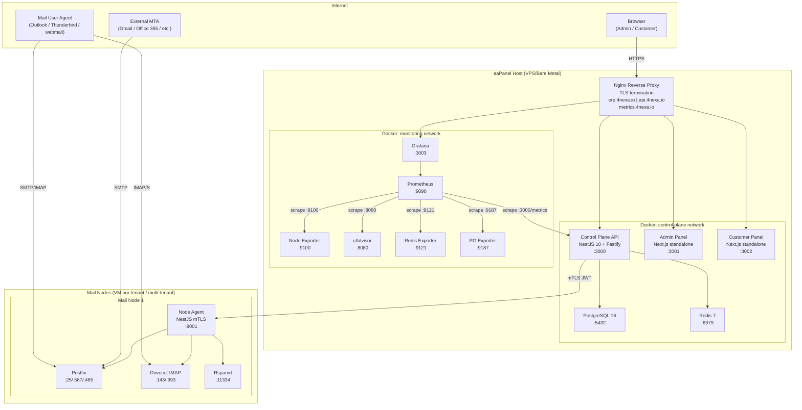
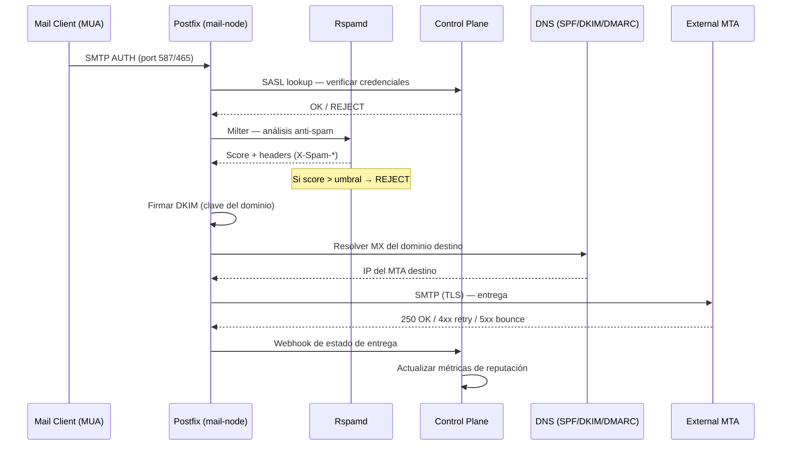
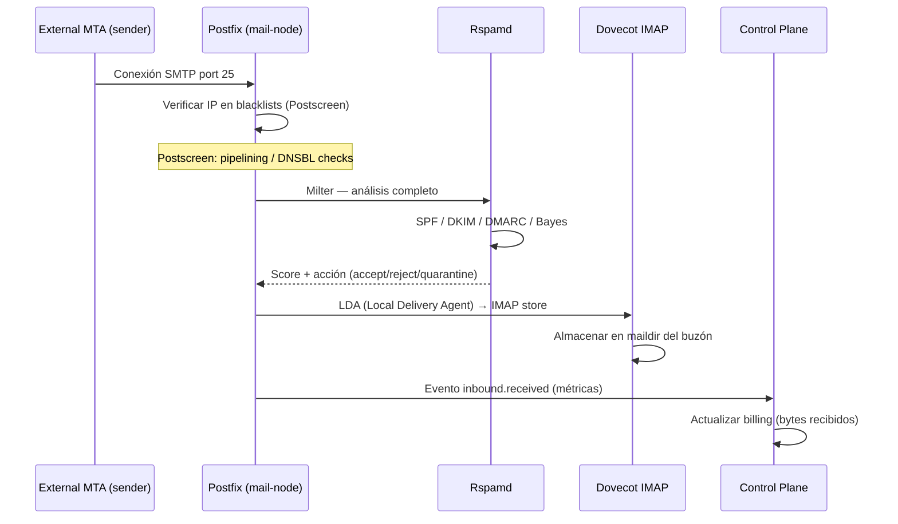
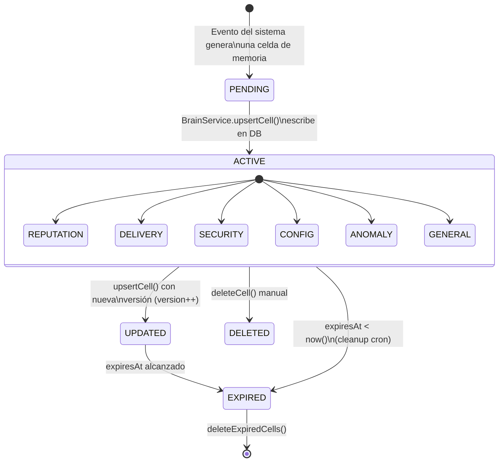
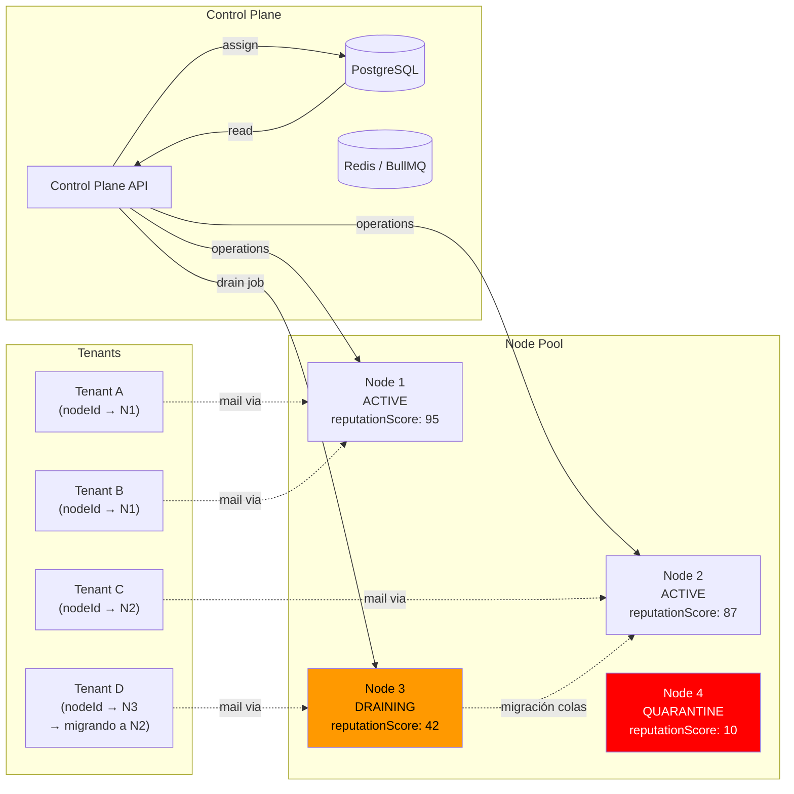
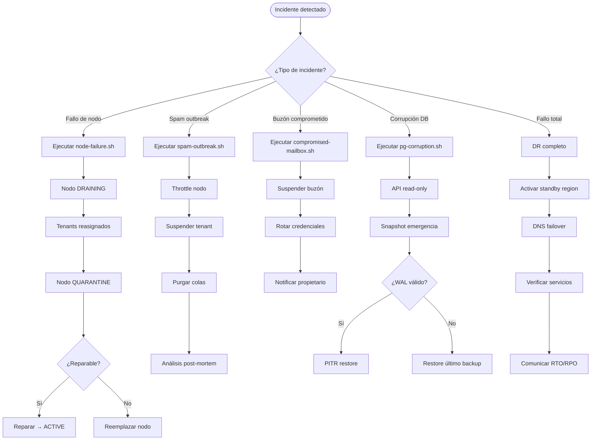
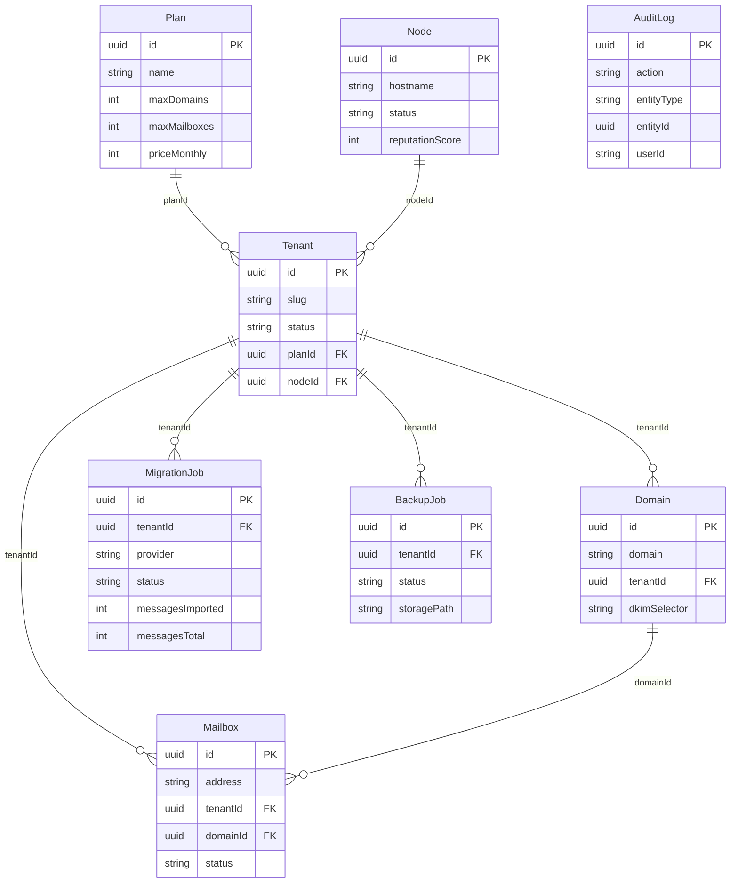

# §38 — Diagramas de Arquitectura 4nexa Mailgun Platform

Este documento contiene los diagramas Mermaid de arquitectura del sistema.
Renderizable en GitHub, GitLab, Notion, y cualquier editor compatible con Mermaid.

---

## 1. Arquitectura Global

---

## 2. Flujo SMTP Outbound

---

## 3. Flujo SMTP Inbound

---

## 4. Mailgun Brain — Ciclo de Vida de Celdas

---

## 5. Arquitectura Multi-Nodo — Asignación y Drenaje

---

## 6. Disaster Recovery — Árbol de Decisión

---

## 7. Modelo de Datos — Entidades Principales

